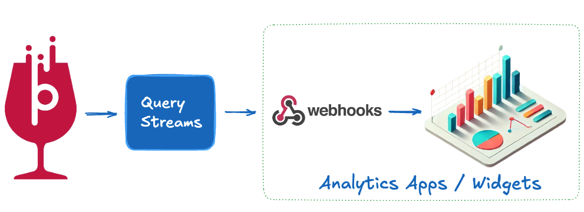
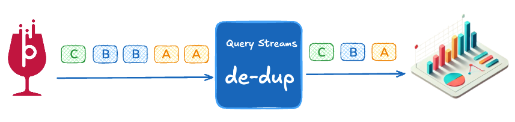

**Query Streams** for Apache Pinot is a lightweight tool that lets UI/application developers rethink how data flows from Pinot to their applications. Instead of pulling data on demand, why not flip the script and push it? Imagine your dashboards, heat maps, or widgets powered by streams that query Pinot for you and deliver the results to webhooks in real-time. It simplifies your UI interfaces, while making the most of Pinot’s raw analytical power.



Today, the tool supports webhooks. We can expand to support a lot more—Kafka, MQs, notifications, alerts—anything is possible. For now, have fun publishing data to a webhook, build some cool apps, and show them off!

---

## **Highlights / Benefits**

### 1. Simplifies Data Delivery to the Frontend
Effortlessly query Apache Pinot in real-time and push data to webhooks. By streaming query results directly to dashboards, heat maps, and widgets, developers can build lightweight UI while leveraging Pinot’s scale to power seamless real-time analytics.

### 2. Reduces Redundancy with Built-In Deduplication
When query results don’t change, Query Streams intelligently skips pushing data to the UI, reducing redundant traffic and saving costs on QPS. This push-first model minimizes the burden on UI components, keeping them lean and efficient while still delivering timely updates when data changes.




### 3. Gives Developers Fine-Grained Control
Throttle query execution, manage deduplication settings, and monitor real-time metrics through an intuitive set of APIs. Developers can streamline their workflows, stay focused on building user-facing apps, and let Pinot handle the heavy lifting in the background.

---

## **What’s Supported Today?**

- **Stream Creation and Management**: Create, start, stop, update, and delete streams using APIs with a unique `stream_id` for identification.
- **Apache Pinot Integration**: Query Apache Pinot periodically and send results to external systems like webhooks, with support for dynamic query configurations.
- **StarTree Free Tier Support**: Supports integration with StarTree Free Tier using Bearer tokens for authentication.
- **Deduplication and Throttling**: Skips redundant query results to reduce QPS and ensures efficient delivery to webhooks, with configurable deduplication and throttling.
- **Metrics Tracking**: Tracks events sent, deduplicated events, and query execution counts with a combination of in-memory caching and periodic file-based persistence.
- **File-Based State Store**: Stores stream configurations and states to ensure streams are preserved and resumed across crashes or restarts.
- **Basic Dashboard**: A minimal dashboard displaying the list of streams and their associated metrics.

---

## **Upcoming Features**

- **Multicast Support**: Send data to multiple destinations for each stream, enabling integrations with webhooks, Kafka, and other external systems.
- **Kafka Support**: Publish stream results to Kafka topics to expand compatibility with real-time processing systems.
- **Advanced UI for Stream Management**: Improved user interface to simplify stream creation, monitoring, and lifecycle management.
- **Webhook Authentication**: Add token-based or API key authentication to secure webhook integrations.
- **Custom Query Transformations**: Enable result transformations (e.g., filtering, aggregation) before delivering data to destinations.
- **Error Handling and Alerts**: Send alerts to developers or teams when streams encounter errors, such as failed queries or webhook delivery issues.
- **Inference Support**: Ability to enrich the outgoing messages with AI / other APIs before hitting the UI.
- **Stream Tags and Metadata**: Allow tagging streams with metadata for better organization and searchability.
- **Parameter Support**: Allow query parameters to be passed dynamically from the UI, enabling greater flexibility in building interactive and personalized analytics experiences.

---

## **Getting Started**

### **Clone the Project**
```bash
git clone <repository-url>
cd qstreams
```

### **Run with Docker**
```bash
docker build -t qstreams .
docker run -p 8080:8080 qstreams
```

### **Deploy to a Cloud Service**
```bash
docker build -t qstreams .
docker run -p 8080:8080 qstreams
```

### **Console access**
```bash
http://localhost:8080/console/
```

[More on Query Streams here](https://gnanaguru.com/p/query-streams-for-apache-pinot)

